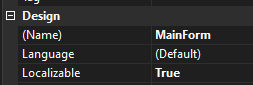
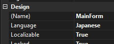
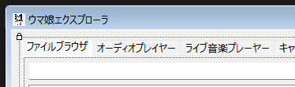

# Localization
This project is built on Windows Forms, which has support for localization built into the 
Visual Studio designer via different resource (`.resx`) files for each language.

To generate localized resources for a form or user control:

1. In your forked repository, open the form in the designer and check if `Localizable` is set to `True`

	
2. Set the `Language` property to the language you want to localize the form in

	
3. Change the text properties of the controls to your localized text

	

Commit the changes of the resource files (or the designer code in some cases) and make a new pull request.
